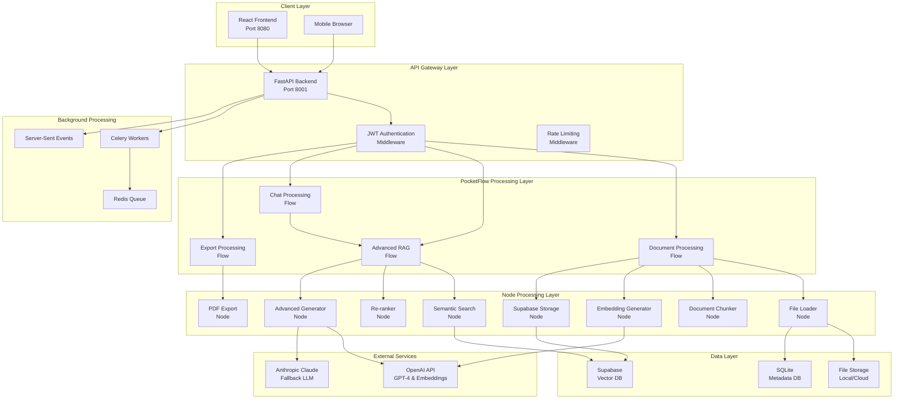

# 4. Technical Requirements & Architecture

## 4.1 System Architecture Overview

### 4.1.1 Architectural Philosophy

The Theo theological research system restoration follows a **PocketFlow-first architecture** that prioritizes:

- **Modularity**: Every processing unit is a self-contained, stateless Node (max 150 lines)
- **Orchestration**: Complex workflows are composed of multiple coordinated Nodes via Flows
- **Observability**: Full visibility into processing pipelines and failure points
- **Scalability**: Async processing patterns enable horizontal scaling
- **Maintainability**: Clear separation of concerns with single-responsibility Nodes

### 4.1.2 System Architecture Diagram



### 4.1.3 Data Flow Architecture

**Document Processing Flow:**
1. Admin uploads document via React frontend
2. FastAPI validates file and creates metadata record in SQLite
3. Celery queues DocumentProcessingFlow with document_id
4. FileLoaderNode retrieves file content and updates status
5. DocumentChunkerNode processes content by type (biblical vs theological)
6. EmbeddingGeneratorNode generates OpenAI embeddings for chunks
7. SupabaseStorageNode stores chunks and embeddings in vector database
8. Real-time status updates sent via SSE to frontend

**RAG Query Flow:**
1. User submits theological question via chat interface
2. QueryEmbedderNode generates question embedding
3. SupabaseSearchNode performs hybrid semantic/keyword search
4. ReRankerNode reorders results for relevance
5. AdvancedGeneratorNode applies hermeneutics filter and generates response
6. Response with citations returned to frontend via WebSocket

## 4.2 Technology Stack Specifications

### 4.2.1 Core Framework Requirements

**PocketFlow Architecture (v0.0.2+)**
- **Purpose**: Primary workflow orchestration framework
- **Node Constraints**: Maximum 150 lines per Node implementation
- **Pattern Requirements**: All Nodes must be stateless with shared store communication
- **Async Support**: AsyncNode patterns for I/O operations, AsyncFlow for orchestration
- **Installation**: `pip install -e ./PocketFlow-main` (local development)

**Critical PocketFlow Patterns:**
```python
# Node Structure Example
class FileLoaderNode(AsyncNode):
    async def prep_async(self, shared_store: SharedStore) -> None:
        # Preparation logic (max 50 lines)
        pass
    
    async def exec_async(self, shared_store: SharedStore) -> None:
        # Core execution logic (max 50 lines)
        pass
    
    async def post_async(self, shared_store: SharedStore) -> None:
        # Post-processing logic (max 50 lines)
        pass
```

### 4.2.2 Backend Technology Requirements

**FastAPI Application Framework**
- **Version**: FastAPI 0.115.0+ with Uvicorn standard features
- **Port Configuration**: **HARDCODED Port 8001** (non-negotiable)
- **Architecture**: PocketFlow Node/Flow patterns for all business logic
- **Authentication**: JWT tokens with bcrypt password hashing
- **Middleware Stack**: CORS, rate limiting, authentication, error handling

**Python Dependencies (Exact Versions)**
```requirements.txt
# Core Framework
fastapi==0.115.0
uvicorn[standard]==0.32.0
python-multipart==0.0.12
pydantic==2.10.2

# PocketFlow Integration
pocketflow>=0.0.2

# LLM & AI
openai>=1.0.0
anthropic>=0.8.0

# Async & HTTP
aiohttp>=3.8.0
aiofiles>=23.0.0

# Background Processing
celery>=5.3.0
redis>=4.5.0

# Data Processing
PyYAML>=6.0
pandas>=2.0.0
numpy>=1.24.0

# Vector Processing
faiss-cpu>=1.7.0

# Authentication
python-jose>=3.3.0
passlib[bcrypt]>=1.7.4

# Database
sqlite3 (built-in)
supabase>=1.0.0

# Development & Testing
pytest>=7.0.0
pytest-asyncio>=0.21.0
requests>=2.32.3
```

### 4.2.3 Frontend Technology Requirements

**React Application Framework**
- **Version**: React 18.3.1 with TypeScript support
- **Port Configuration**: **HARDCODED Port 8080** (non-negotiable)
- **Build Tool**: Vite for development and production builds
- **Styling**: TailwindCSS with shadcn/ui component library

**Frontend Dependencies (Exact Versions)**
```package.json
{
  "dependencies": {
    "react": "^18.3.1",
    "react-dom": "^18.3.1",
    "typescript": "^5.0.0",
    "@types/react": "^18.3.0",
    "@types/react-dom": "^18.3.0",
    "vite": "^5.0.0",
    "tailwindcss": "^3.4.0",
    "axios": "^1.6.0",
    "zustand": "^4.4.0",
    "react-hook-form": "^7.48.0",
    "lucide-react": "^0.263.0",
    "@radix-ui/react-slot": "^1.0.2",
    "clsx": "^2.0.0",
    "tailwind-merge": "^2.0.0"
  }
}
```

## 4.3 Backend Technical Requirements

### 4.3.1 FastAPI Application Structure

**Directory Architecture:**
```
apps/api/
├── main.py                 # FastAPI application entry point
├── src/
│   ├── api/               # API route definitions
│   │   ├── auth_routes.py
│   │   ├── chat_routes.py
│   │   ├── document_routes.py
│   │   └── admin_routes.py
│   ├── flows/             # PocketFlow Flow implementations
│   │   ├── document_processing_flow.py
│   │   ├── advanced_rag_flow.py
│   │   ├── chat_flow.py
│   │   └── export_flow.py
│   ├── nodes/             # PocketFlow Node implementations
│   │   ├── documents/     # Document processing nodes
│   │   ├── chat/          # Chat processing nodes
│   │   └── admin/         # Admin workflow nodes
│   ├── core/              # Core configuration and utilities
│   │   ├── config.py
│   │   ├── database.py
│   │   └── celery_app.py
│   └── utils/             # Shared utilities
│       ├── embedding_utils.py
│       ├── chunking_utils.py
│       └── supabase_utils.py
└── requirements.txt
```

### 4.3.2 PocketFlow Node Requirements

**Document Processing Nodes:**
1. **FileLoaderNode** (≤150 lines)
   - Loads file content from storage
   - Updates document status to "processing"
   - Validates file integrity and format
   
2. **DocumentChunkerNode** (≤150 lines)
   - Biblical: 5-verse chunks with 1-verse overlap
   - Theological: 1000-character chunks with 200-character overlap
   - Preserves citation metadata for all chunks
   
3. **EmbeddingGeneratorNode** (≤150 lines)
   - Generates OpenAI embeddings (text-embedding-ada-002)
   - Handles API rate limiting and retries
   - Batches requests for efficiency
   
4. **SupabaseStorageNode** (≤150 lines)
   - Stores chunks and embeddings in Supabase
   - Updates document status to "completed"
   - Handles transaction rollback on failures

**Chat Processing Nodes:**
1. **QueryEmbedderNode** (≤150 lines)
   - Generates embeddings for user queries
   - Handles query preprocessing and normalization
   
2. **SupabaseSearchNode** (≤150 lines)
   - Performs hybrid semantic and keyword search
   - Returns top-k relevant chunks with scores
   
3. **ReRankerNode** (≤150 lines)
   - Re-ranks search results using contextual scoring
   - Applies theological relevance weighting
   
4. **AdvancedGeneratorNode** (≤150 lines)
   - Applies hermeneutics filter system prompt
   - Generates responses with source citations
   - Handles LLM fallback (OpenAI → Anthropic)

### 4.3.3 API Endpoint Specifications

**Authentication Endpoints:**
```python
POST /api/auth/register
- Request: {"email": str, "password": str}
- Response: {"message": str, "user_id": str}
- Status: 201 Created | 400 Bad Request

POST /api/auth/login  
- Request: {"email": str, "password": str}
- Response: {"access_token": str, "token_type": "bearer", "user": {...}}
- Status: 200 OK | 401 Unauthorized

POST /api/auth/logout
- Headers: Authorization: Bearer <token>
- Response: {"message": "Successfully logged out"}
- Status: 200 OK
```

**Document Management Endpoints:**
```python
POST /api/admin/documents/upload
- Headers: Authorization: Bearer <admin_token>
- Content-Type: multipart/form-data
- Request: file, document_type, metadata
- Response: {"document_id": str, "status": "queued"}
- Status: 202 Accepted | 413 Payload Too Large

GET /api/admin/documents
- Headers: Authorization: Bearer <admin_token>
- Query: page, limit, status, document_type
- Response: {"documents": [...], "total": int, "page": int}
- Status: 200 OK

DELETE /api/admin/documents/{document_id}
- Headers: Authorization: Bearer <admin_token>
- Response: {"message": "Document deleted successfully"}
- Status: 200 OK | 404 Not Found
```

**Chat Endpoints:**
```python
POST /api/chat
- Headers: Authorization: Bearer <token>
- Request: {"message": str, "conversation_id": str}
- Response: {"response": str, "sources": [...], "conversation_id": str}
- Status: 200 OK | 429 Too Many Requests

GET /api/chat/conversations
- Headers: Authorization: Bearer <token>
- Response: {"conversations": [...]}
- Status: 200 OK

WebSocket /api/chat/ws
- Protocol: WebSocket upgrade for real-time chat
- Authentication: JWT token in query parameters
```

**Real-time Status Endpoints:**
```python
GET /api/admin/documents/{document_id}/status
- Headers: Authorization: Bearer <admin_token>
- Accept: text/event-stream
- Response: Server-Sent Events stream
- Status: 200 OK | 404 Not Found
```

### 4.3.4 Authentication & Authorization

**JWT Token Structure:**
```python
{
  "sub": "user_id",
  "email": "user@example.com", 
  "role": "user|admin",
  "status": "approved|pending",
  "exp": timestamp,
  "iat": timestamp
}
```

**Role-Based Access Control:**
- **Public Routes**: `/api/auth/register`, `/api/auth/login`, `/health`
- **User Routes**: `/api/chat/*`, `/api/export/*`, `/api/user/*`
- **Admin Routes**: `/api/admin/*`, `/api/documents/upload`
- **Middleware**: Validates JWT and enforces role requirements

### 4.3.5 Background Processing Architecture

**Celery Configuration:**
```python
# celery_app.py
from celery import Celery

celery_app = Celery(
    "theo_worker",
    broker="redis://localhost:6379/0",
    backend="redis://localhost:6379/0",
    include=["src.flows"]
)

celery_app.conf.update(
    task_routes={
        "src.flows.document_processing_flow.process_document": {"queue": "document_processing"},
        "src.flows.advanced_rag_flow.process_query": {"queue": "chat_processing"},
    },
    worker_prefetch_multiplier=1,
    task_acks_late=True,
    worker_max_tasks_per_child=1000,
)
```

**Task Definitions:**
```python
@celery_app.task(bind=True, max_retries=3)
def process_document_task(self, document_id: str):
    try:
        flow = DocumentProcessingFlow()
        result = flow.run_async({"document_id": document_id})
        return result
    except Exception as exc:
        raise self.retry(exc=exc, countdown=60)
```

## 4.4 Frontend Technical Requirements

### 4.4.1 React Application Structure

**Component Architecture:**
```
apps/web/src/
├── components/
│   ├── ui/                # shadcn/ui base components
│   ├── layout/            # Layout components
│   ├── auth/              # Authentication components
│   ├── admin/             # Admin dashboard components
│   ├── chat/              # Chat interface components
│   └── documents/         # Document management components
├── pages/
│   ├── LoginPage.tsx
│   ├── RegisterPage.tsx
│   ├── ChatPage.tsx
│   ├── AdminDashboard.tsx
│   └── DocumentManagement.tsx
├── services/
│   ├── api.ts             # Axios configuration
│   ├── auth.ts            # Authentication service
│   ├── chat.ts            # Chat WebSocket service
│   └── documents.ts       # Document management service
├── stores/
│   ├── authStore.ts       # Authentication state
│   ├── chatStore.ts       # Chat state management
│   └── documentStore.ts   # Document management state
├── types/
│   ├── api.ts             # API response types
│   ├── auth.ts            # Authentication types
│   └── chat.ts            # Chat interface types
└── utils/
    ├── constants.ts       # Application constants
    ├── formatters.ts      # Data formatting utilities
    └── validation.ts      # Form validation schemas
```

### 4.4.2 State Management Requirements

**Zustand Store Configuration:**
```typescript
// authStore.ts
interface AuthState {
  user: User | null;
  token: string | null;
  isAuthenticated: boolean;
  isLoading: boolean;
  login: (credentials: LoginCredentials) => Promise<void>;
  logout: () => void;
  register: (userData: RegisterData) => Promise<void>;
}

// chatStore.ts  
interface ChatState {
  conversations: Conversation[];
  activeConversation: string | null;
  messages: Message[];
  isLoading: boolean;
  sendMessage: (message: string) => Promise<void>;
  createConversation: () => string;
  loadConversation: (id: string) => Promise<void>;
}

// documentStore.ts
interface DocumentState {
  documents: Document[];
  uploadProgress: Record<string, number>;
  processingStatus: Record<string, ProcessingStatus>;
  uploadDocument: (file: File, metadata: DocumentMetadata) => Promise<void>;
  deleteDocument: (id: string) => Promise<void>;
  subscribeToStatus: (documentId: string) => () => void;
}
```

### 4.4.3 Real-time Communication

**WebSocket Integration:**
```typescript
// services/chat.ts
class ChatWebSocketService {
  private ws: WebSocket | null = null;
  private reconnectAttempts = 0;
  private maxReconnectAttempts = 5;
  
  connect(token: string): Promise<void> {
    return new Promise((resolve, reject) => {
      this.ws = new WebSocket(`ws://localhost:8001/api/chat/ws?token=${token}`);
      this.ws.onmessage = this.handleMessage;
      this.ws.onclose = this.handleClose;
      this.ws.onerror = this.handleError;
    });
  }
  
  sendMessage(message: ChatMessage): void {
    if (this.ws?.readyState === WebSocket.OPEN) {
      this.ws.send(JSON.stringify(message));
    }
  }
}
```

**Server-Sent Events Integration:**
```typescript
// services/documents.ts
class DocumentStatusService {
  subscribeToDocumentStatus(documentId: string, callback: (status: ProcessingStatus) => void): () => void {
    const eventSource = new EventSource(
      `/api/admin/documents/${documentId}/status`,
      { headers: { Authorization: `Bearer ${getToken()}` } }
    );
    
    eventSource.onmessage = (event) => {
      const status = JSON.parse(event.data);
      callback(status);
    };
    
    return () => eventSource.close();
  }
}
```

### 4.4.4 UI/UX Requirements

**Design System Requirements:**
- **Color Scheme**: 
  - Biblical content: Blue theme (#3B82F6)
  - Theological content: Light maroon (#B03060) 
  - Other content: Green theme (#10B981)
- **Typography**: System font stack with fallbacks
- **Accessibility**: WCAG AA compliance
- **Responsive**: Mobile-first design with breakpoints at 768px, 1024px, 1280px

**Component Requirements:**
```typescript
// Chat Interface Component
interface ChatInterfaceProps {
  conversationId: string;
  onMessageSent: (message: string) => void;
  onSourceSelected: (source: Source) => void;
}

// Document Upload Component  
interface DocumentUploadProps {
  onUploadStart: (file: File) => void;
  onUploadProgress: (progress: number) => void;
  onUploadComplete: (documentId: string) => void;
  maxFileSize: number; // 5MB for biblical, 100MB for theological
  acceptedTypes: string[];
}

// Admin Dashboard Component
interface AdminDashboardProps {
  userStats: UserStatistics;
  documentStats: DocumentStatistics;
  systemStats: SystemStatistics;
  onUserAction: (action: UserAction) => void;
}
```

## 4.5 Database & Storage Requirements

### 4.5.1 SQLite Schema (Local Metadata)

```sql
-- Users table
CREATE TABLE users (
    id INTEGER PRIMARY KEY AUTOINCREMENT,
    email VARCHAR(255) UNIQUE NOT NULL,
    password_hash VARCHAR(255) NOT NULL,
    role VARCHAR(20) DEFAULT 'user' CHECK (role IN ('user', 'admin')),
    status VARCHAR(20) DEFAULT 'pending' CHECK (status IN ('pending', 'approved', 'rejected')),
    created_at TIMESTAMP DEFAULT CURRENT_TIMESTAMP,
    updated_at TIMESTAMP DEFAULT CURRENT_TIMESTAMP
);

-- Documents table
CREATE TABLE documents (
    id INTEGER PRIMARY KEY AUTOINCREMENT,
    filename VARCHAR(255) NOT NULL,
    original_filename VARCHAR(255) NOT NULL,
    document_type VARCHAR(20) NOT NULL CHECK (document_type IN ('biblical', 'theological', 'other')),
    file_size INTEGER NOT NULL,
    mime_type VARCHAR(100) NOT NULL,
    file_path VARCHAR(500) NOT NULL,
    status VARCHAR(20) DEFAULT 'queued' CHECK (status IN ('queued', 'processing', 'completed', 'failed')),
    error_message TEXT,
    chunks_count INTEGER DEFAULT 0,
    uploaded_by INTEGER NOT NULL,
    created_at TIMESTAMP DEFAULT CURRENT_TIMESTAMP,
    updated_at TIMESTAMP DEFAULT CURRENT_TIMESTAMP,
    FOREIGN KEY (uploaded_by) REFERENCES users (id)
);

-- Processing jobs table
CREATE TABLE processing_jobs (
    id INTEGER PRIMARY KEY AUTOINCREMENT,
    document_id INTEGER NOT NULL,
    job_type VARCHAR(50) NOT NULL,
    status VARCHAR(20) DEFAULT 'queued',
    celery_task_id VARCHAR(255),
    started_at TIMESTAMP,
    completed_at TIMESTAMP,
    error_details TEXT,
    FOREIGN KEY (document_id) REFERENCES documents (id)
);

-- Chat conversations table
CREATE TABLE conversations (
    id INTEGER PRIMARY KEY AUTOINCREMENT,
    user_id INTEGER NOT NULL,
    title VARCHAR(255),
    created_at TIMESTAMP DEFAULT CURRENT_TIMESTAMP,
    updated_at TIMESTAMP DEFAULT CURRENT_TIMESTAMP,
    FOREIGN KEY (user_id) REFERENCES users (id)
);

-- Chat messages table
CREATE TABLE messages (
    id INTEGER PRIMARY KEY AUTOINCREMENT,
    conversation_id INTEGER NOT NULL,
    role VARCHAR(20) NOT NULL CHECK (role IN ('user', 'assistant')),
    content TEXT NOT NULL,
    sources JSON, -- JSON array of source references
    created_at TIMESTAMP DEFAULT CURRENT_TIMESTAMP,
    FOREIGN KEY (conversation_id) REFERENCES conversations (id)
);
```

### 4.5.2 Supabase Schema (Vector Database)

```sql
-- Enable pgvector extension
CREATE EXTENSION IF NOT EXISTS vector;

-- Document chunks table
CREATE TABLE document_chunks (
    id UUID PRIMARY KEY DEFAULT gen_random_uuid(),
    document_id INTEGER NOT NULL, -- References SQLite documents.id
    chunk_index INTEGER NOT NULL,
    content TEXT NOT NULL,
    content_type VARCHAR(20) NOT NULL CHECK (content_type IN ('biblical', 'theological', 'other')),
    embedding vector(1536), -- OpenAI ada-002 embedding dimension
    metadata JSONB NOT NULL, -- Flexible metadata storage
    citation_data JSONB, -- Biblical: book, chapter, verse; Theological: page, section
    word_count INTEGER,
    created_at TIMESTAMP WITH TIME ZONE DEFAULT NOW(),
    
    -- Composite index for efficient querying
    UNIQUE(document_id, chunk_index)
);

-- Indexes for vector similarity search
CREATE INDEX document_chunks_embedding_idx ON document_chunks 
USING ivfflat (embedding vector_cosine_ops) WITH (lists = 100);

-- Indexes for metadata filtering
CREATE INDEX document_chunks_document_id_idx ON document_chunks (document_id);
CREATE INDEX document_chunks_content_type_idx ON document_chunks (content_type);
CREATE INDEX document_chunks_metadata_idx ON document_chunks USING GIN (metadata);

-- Full-text search index for hybrid search
CREATE INDEX document_chunks_content_fts_idx ON document_chunks 
USING GIN (to_tsvector('english', content));

-- Function for hybrid search (semantic + keyword)
CREATE OR REPLACE FUNCTION hybrid_search(
    query_embedding vector(1536),
    query_text text,
    content_type_filter text DEFAULT NULL,
    similarity_threshold float DEFAULT 0.7,
    limit_count integer DEFAULT 10
)
RETURNS TABLE (
    id UUID,
    content TEXT,
    similarity FLOAT,
    citation_data JSONB,
    metadata JSONB
) AS $$
BEGIN
    RETURN QUERY
    SELECT 
        dc.id,
        dc.content,
        (1 - (dc.embedding <=> query_embedding)) as similarity,
        dc.citation_data,
        dc.metadata
    FROM document_chunks dc
    WHERE 
        (content_type_filter IS NULL OR dc.content_type = content_type_filter)
        AND (1 - (dc.embedding <=> query_embedding)) > similarity_threshold
        AND (query_text = '' OR to_tsvector('english', dc.content) @@ plainto_tsquery('english', query_text))
    ORDER BY 
        (1 - (dc.embedding <=> query_embedding)) DESC,
        ts_rank(to_tsvector('english', dc.content), plainto_tsquery('english', query_text)) DESC
    LIMIT limit_count;
END;
$$ LANGUAGE plpgsql;
```

### 4.5.3 File Storage Requirements

**Local Development Storage:**
```
apps/api/uploads/
├── documents/
│   ├── biblical/          # JSON files
│   └── theological/       # PDF files
└── temp/                  # Temporary processing files
```

**Production Storage (DigitalOcean Spaces):**
- **Bucket Structure**: `theo-documents/{document_type}/{document_id}/`
- **Access Control**: Authenticated access only
- **CDN**: CloudFlare for static asset delivery
- **Backup**: Daily automated backups to separate bucket

## 4.6 AI/ML Integration Requirements

### 4.6.1 OpenAI API Integration

**Primary LLM Configuration:**
```python
# OpenAI client configuration
openai_client = OpenAI(
    api_key=settings.OPENAI_API_KEY,
    timeout=30.0,
    max_retries=3
)

# Embedding model specification
EMBEDDING_MODEL = "text-embedding-ada-002"
EMBEDDING_DIMENSIONS = 1536
EMBEDDING_BATCH_SIZE = 100

# Generation model specification  
GENERATION_MODEL = "gpt-4-turbo-preview"
MAX_TOKENS = 4096
TEMPERATURE = 0.1  # Low temperature for factual accuracy
```

**Usage Patterns:**
```python
# Embedding generation
async def generate_embedding(text: str) -> List[float]:
    response = await openai_client.embeddings.create(
        model=EMBEDDING_MODEL,
        input=text,
        encoding_format="float"
    )
    return response.data[0].embedding

# Text generation with hermeneutics filter
async def generate_response(prompt: str, context: str) -> str:
    system_prompt = load_hermeneutics_filter()
    response = await openai_client.chat.completions.create(
        model=GENERATION_MODEL,
        messages=[
            {"role": "system", "content": system_prompt},
            {"role": "user", "content": f"Context: {context}\n\nQuestion: {prompt}"}
        ],
        temperature=TEMPERATURE,
        max_tokens=MAX_TOKENS
    )
    return response.choices[0].message.content
```

### 4.6.2 Anthropic Claude Fallback

**Fallback Configuration:**
```python
# Anthropic client configuration
anthropic_client = Anthropic(
    api_key=settings.ANTHROPIC_API_KEY,
    timeout=30.0,
    max_retries=3
)

# Model specification
CLAUDE_MODEL = "claude-3-sonnet-20240229"

# Fallback logic
async def generate_with_fallback(prompt: str, context: str) -> str:
    try:
        return await generate_openai_response(prompt, context)
    except OpenAIError as e:
        logger.warning(f"OpenAI API failed: {e}, falling back to Claude")
        return await generate_claude_response(prompt, context)
```

### 4.6.3 Hermeneutics Filter Implementation

**System Prompt Template:**
```python
HERMENEUTICS_FILTER = """
You are a theological research assistant specializing in Moral Government Theology. 
You must adhere to these hermeneutical principles:

1. SCRIPTURAL AUTHORITY: Scripture alone is the ultimate authority for theological truth
2. LITERAL INTERPRETATION: Interpret Scripture literally unless context clearly indicates otherwise
3. CONTEXTUAL ANALYSIS: Always consider immediate, book, and canonical context
4. PROGRESSIVE REVELATION: Earlier revelation is clarified by later revelation
5. MORAL GOVERNMENT: God's government is moral, not arbitrary; His laws reflect His character
6. HUMAN RESPONSIBILITY: Humans are free moral agents responsible for their choices
7. SOURCE FIDELITY: All responses must be verifiably derived from provided source texts

CRITICAL CONSTRAINTS:
- Never contradict or go beyond what is explicitly stated in the provided sources
- If sources are insufficient to answer a question, clearly state this limitation
- Always provide specific citations for theological claims
- Distinguish between what Scripture teaches and human theological interpretations
- Maintain theological consistency with Moral Government Theology principles

When generating responses:
1. Review all provided source material carefully
2. Extract only information directly supported by the sources
3. Provide specific citations for all theological claims
4. Note any limitations in available source material
5. Maintain clarity between biblical text and theological commentary
"""
```

## 4.7 Workflow Orchestration (PocketFlow)

### 4.7.1 Document Processing Flow

**Flow Implementation:**
```python
class DocumentProcessingFlow(AsyncFlow):
    def __init__(self):
        super().__init__()
        self.add_node("file_loader", FileLoaderNode())
        self.add_node("document_chunker", DocumentChunkerNode())
        self.add_node("embedding_generator", EmbeddingGeneratorNode())
        self.add_node("supabase_storage", SupabaseStorageNode())
        
        # Define processing pipeline
        self.add_edge("file_loader", "document_chunker")
        self.add_edge("document_chunker", "embedding_generator") 
        self.add_edge("embedding_generator", "supabase_storage")
    
    async def run_async(self, initial_data: Dict[str, Any]) -> Dict[str, Any]:
        shared_store = SharedStore(initial_data)
        
        try:
            await self.execute_flow(shared_store)
            return shared_store.get_all()
        except Exception as e:
            # Update document status to failed
            await self.handle_processing_error(shared_store, e)
            raise
```

### 4.7.2 Advanced RAG Flow

**Flow Implementation:**
```python
class AdvancedRAGFlow(AsyncFlow):
    def __init__(self):
        super().__init__()
        self.add_node("query_embedder", QueryEmbedderNode())
        self.add_node("semantic_search", SemanticSearchNode())
        self.add_node("re_ranker", ReRankerNode())
        self.add_node("generator", AdvancedGeneratorNode())
        
        # Define RAG pipeline
        self.add_edge("query_embedder", "semantic_search")
        self.add_edge("semantic_search", "re_ranker")
        self.add_edge("re_ranker", "generator")
    
    async def run_async(self, query_data: Dict[str, Any]) -> Dict[str, Any]:
        shared_store = SharedStore(query_data)
        await self.execute_flow(shared_store)
        
        return {
            "response": shared_store.get("generated_response"),
            "sources": shared_store.get("relevant_sources"),
            "confidence": shared_store.get("confidence_score")
        }
```

### 4.7.3 Node Implementation Standards

**Node Template:**
```python
class TheoLogicalNode(AsyncNode):
    """Base class for all Theo theological processing nodes."""
    
    def __init__(self, name: str, max_retries: int = 3):
        super().__init__(name)
        self.max_retries = max_retries
        self.retry_count = 0
    
    async def prep_async(self, shared_store: SharedStore) -> None:
        """Preparation phase - validate inputs and setup."""
        self.validate_inputs(shared_store)
        await self.setup_resources()
    
    async def exec_async(self, shared_store: SharedStore) -> None:
        """Core execution phase - main processing logic."""
        try:
            result = await self.process_data(shared_store)
            shared_store.set(f"{self.name}_result", result)
        except Exception as e:
            if self.retry_count < self.max_retries:
                self.retry_count += 1
                await self.exec_async(shared_store)
            else:
                raise
    
    async def post_async(self, shared_store: SharedStore) -> None:
        """Post-processing phase - cleanup and result handling."""
        await self.cleanup_resources()
        self.update_metrics(shared_store)
```

## 4.8 Background Processing (Redis/Celery)

### 4.8.1 Redis Configuration

**Redis Setup Requirements:**
```python
# Redis connection configuration
REDIS_CONFIG = {
    "host": "localhost",
    "port": 6379,
    "db": 0,
    "decode_responses": True,
    "socket_keepalive": True,
    "socket_keepalive_options": {},
    "health_check_interval": 30,
    "retry_on_timeout": True,
    "password": None  # Set in production
}

# Queue configuration
CELERY_QUEUES = {
    "document_processing": {
        "priority": 1,
        "max_workers": 2,
        "concurrency": 1
    },
    "chat_processing": {
        "priority": 2, 
        "max_workers": 4,
        "concurrency": 2
    },
    "export_processing": {
        "priority": 3,
        "max_workers": 1,
        "concurrency": 1
    }
}
```

### 4.8.2 Celery Worker Configuration

**Worker Setup:**
```python
# celery_config.py
from celery import Celery
from kombu import Queue

celery_app = Celery("theo_worker")

celery_app.conf.update(
    broker_url="redis://localhost:6379/0",
    result_backend="redis://localhost:6379/0",
    
    # Task routing
    task_routes={
        "process_document": {"queue": "document_processing"},
        "process_chat_query": {"queue": "chat_processing"},
        "generate_export": {"queue": "export_processing"},
    },
    
    # Worker configuration
    worker_prefetch_multiplier=1,
    task_acks_late=True,
    worker_max_tasks_per_child=1000,
    worker_disable_rate_limits=True,
    
    # Result configuration
    result_expires=3600,
    result_persistent=True,
    
    # Retry configuration
    task_reject_on_worker_lost=True,
    task_default_retry_delay=60,
    task_max_retries=3,
    
    # Queue configuration
    task_create_missing_queues=True,
    task_default_queue="default",
)

# Queue definitions
celery_app.conf.task_queues = (
    Queue("document_processing", routing_key="document_processing"),
    Queue("chat_processing", routing_key="chat_processing"),
    Queue("export_processing", routing_key="export_processing"),
)
```

### 4.8.3 Task Monitoring & Retry Logic

**Task Implementation Pattern:**
```python
@celery_app.task(bind=True, max_retries=3, default_retry_delay=60)
def process_document_task(self, document_id: str):
    """Process uploaded document through PocketFlow pipeline."""
    try:
        # Initialize processing flow
        flow = DocumentProcessingFlow()
        
        # Execute with progress tracking
        with task_progress_tracker(self.request.id) as tracker:
            result = await flow.run_async({
                "document_id": document_id,
                "progress_tracker": tracker
            })
        
        # Update document status
        update_document_status(document_id, "completed", result)
        
        # Send completion notification
        send_sse_update(document_id, {
            "status": "completed",
            "chunks_processed": result.get("chunk_count", 0),
            "processing_time": result.get("processing_time", 0)
        })
        
        return result
        
    except RetryableError as exc:
        # Retry on temporary failures
        logger.warning(f"Retryable error processing document {document_id}: {exc}")
        raise self.retry(exc=exc, countdown=60 * (2 ** self.request.retries))
        
    except Exception as exc:
        # Mark as failed on permanent failures
        logger.error(f"Failed to process document {document_id}: {exc}")
        update_document_status(document_id, "failed", {"error": str(exc)})
        send_sse_update(document_id, {"status": "failed", "error": str(exc)})
        raise
```

## 4.9 Real-time Communication (SSE)

### 4.9.1 Server-Sent Events Implementation

**SSE Endpoint Configuration:**
```python
from fastapi import FastAPI, Depends
from fastapi.responses import StreamingResponse
from sse_starlette.sse import EventSourceResponse

@app.get("/api/admin/documents/{document_id}/status")
async def document_status_stream(
    document_id: str,
    current_user: User = Depends(get_current_admin_user)
):
    """Stream real-time document processing status updates."""
    
    async def event_generator():
        last_status = None
        
        while True:
            try:
                # Check current processing status
                current_status = await get_document_processing_status(document_id)
                
                # Send update if status changed
                if current_status != last_status:
                    yield {
                        "event": "status_update",
                        "data": json.dumps({
                            "document_id": document_id,
                            "status": current_status.status,
                            "progress": current_status.progress,
                            "message": current_status.message,
                            "timestamp": current_status.updated_at.isoformat()
                        })
                    }
                    last_status = current_status
                
                # Exit if processing complete or failed
                if current_status.status in ["completed", "failed"]:
                    break
                
                # Wait before next check
                await asyncio.sleep(1.0)
                
            except Exception as e:
                logger.error(f"Error in SSE stream for document {document_id}: {e}")
                yield {
                    "event": "error",
                    "data": json.dumps({"error": "Connection error"})
                }
                break
    
    return EventSourceResponse(event_generator())
```

### 4.9.2 WebSocket Chat Implementation

**WebSocket Configuration:**
```python
from fastapi import WebSocket, WebSocketDisconnect
import json

class ChatWebSocketManager:
    def __init__(self):
        self.active_connections: Dict[str, WebSocket] = {}
    
    async def connect(self, websocket: WebSocket, user_id: str):
        await websocket.accept()
        self.active_connections[user_id] = websocket
    
    def disconnect(self, user_id: str):
        if user_id in self.active_connections:
            del self.active_connections[user_id]
    
    async def send_message(self, user_id: str, message: dict):
        if user_id in self.active_connections:
            websocket = self.active_connections[user_id]
            await websocket.send_text(json.dumps(message))

chat_manager = ChatWebSocketManager()

@app.websocket("/api/chat/ws")
async def chat_websocket(websocket: WebSocket, token: str = Query(...)):
    # Authenticate user from token
    user = await authenticate_jwt_token(token)
    if not user:
        await websocket.close(code=4001, reason="Authentication failed")
        return
    
    await chat_manager.connect(websocket, user.id)
    
    try:
        while True:
            # Receive message from client
            data = await websocket.receive_text()
            message_data = json.loads(data)
            
            # Process chat message through RAG flow
            response = await process_chat_message(
                user_id=user.id,
                message=message_data["message"],
                conversation_id=message_data.get("conversation_id")
            )
            
            # Send response back to client
            await chat_manager.send_message(user.id, {
                "type": "chat_response",
                "data": response
            })
            
    except WebSocketDisconnect:
        chat_manager.disconnect(user.id)
    except Exception as e:
        logger.error(f"WebSocket error for user {user.id}: {e}")
        await websocket.close(code=1011, reason="Internal server error")
```

## 4.10 Integration Requirements

### 4.10.1 Supabase Integration

**Client Configuration:**
```python
from supabase import create_client, Client
import asyncio

class SupabaseManager:
    def __init__(self):
        self.url = settings.SUPABASE_URL
        self.key = settings.SUPABASE_ANON_KEY
        self.client: Client = create_client(self.url, self.key)
    
    async def store_document_chunks(self, chunks: List[DocumentChunk]) -> bool:
        """Store document chunks with embeddings in Supabase."""
        try:
            chunk_data = [
                {
                    "document_id": chunk.document_id,
                    "chunk_index": chunk.index,
                    "content": chunk.content,
                    "content_type": chunk.content_type,
                    "embedding": chunk.embedding,
                    "metadata": chunk.metadata,
                    "citation_data": chunk.citation_data,
                    "word_count": len(chunk.content.split())
                }
                for chunk in chunks
            ]
            
            result = self.client.table("document_chunks").insert(chunk_data).execute()
            
            if result.data:
                logger.info(f"Successfully stored {len(chunks)} chunks")
                return True
            else:
                logger.error(f"Failed to store chunks: {result}")
                return False
                
        except Exception as e:
            logger.error(f"Error storing chunks in Supabase: {e}")
            return False
    
    async def hybrid_search(
        self, 
        query_embedding: List[float], 
        query_text: str,
        content_type: str = None,
        limit: int = 10
    ) -> List[SearchResult]:
        """Perform hybrid semantic and keyword search."""
        try:
            # Use the hybrid_search function defined in Supabase
            result = self.client.rpc("hybrid_search", {
                "query_embedding": query_embedding,
                "query_text": query_text,
                "content_type_filter": content_type,
                "limit_count": limit
            }).execute()
            
            return [
                SearchResult(
                    id=row["id"],
                    content=row["content"],
                    similarity=row["similarity"],
                    citation_data=row["citation_data"],
                    metadata=row["metadata"]
                )
                for row in result.data
            ]
            
        except Exception as e:
            logger.error(f"Error performing hybrid search: {e}")
            return []
```

### 4.10.2 File Processing Integration

**File Type Processing:**
```python
class DocumentProcessor:
    """Process different document types according to theological requirements."""
    
    async def process_biblical_json(self, file_path: str) -> List[TextChunk]:
        """Process biblical JSON with verse-level chunking."""
        with open(file_path, 'r', encoding='utf-8') as f:
            biblical_data = json.load(f)
        
        chunks = []
        for book in biblical_data.get("books", []):
            book_name = book["name"]
            for chapter in book.get("chapters", []):
                chapter_num = chapter["chapter"]
                verses = chapter.get("verses", [])
                
                # Create 5-verse chunks with 1-verse overlap
                for i in range(0, len(verses), 4):  # Step by 4 for 1-verse overlap
                    chunk_verses = verses[i:i+5]
                    content = " ".join([v["text"] for v in chunk_verses])
                    
                    citation_data = {
                        "book": book_name,
                        "chapter": chapter_num,
                        "verse_start": chunk_verses[0]["verse"],
                        "verse_end": chunk_verses[-1]["verse"],
                        "version": biblical_data.get("version", "Unknown")
                    }
                    
                    chunks.append(TextChunk(
                        content=content,
                        content_type="biblical",
                        citation_data=citation_data,
                        metadata={"book": book_name, "chapter": chapter_num}
                    ))
        
        return chunks
    
    async def process_theological_pdf(self, file_path: str) -> List[TextChunk]:
        """Process theological PDF with page-based chunking."""
        # Use PyPDF2 or similar for PDF extraction
        import PyPDF2
        
        chunks = []
        with open(file_path, 'rb') as f:
            pdf_reader = PyPDF2.PdfReader(f)
            
            for page_num, page in enumerate(pdf_reader.pages, 1):
                page_text = page.extract_text()
                
                # Split into 1000-character chunks with 200-character overlap
                chunk_size = 1000
                overlap = 200
                
                for i in range(0, len(page_text), chunk_size - overlap):
                    chunk_text = page_text[i:i + chunk_size]
                    
                    citation_data = {
                        "page": page_num,
                        "document": os.path.basename(file_path)
                    }
                    
                    chunks.append(TextChunk(
                        content=chunk_text,
                        content_type="theological",
                        citation_data=citation_data,
                        metadata={"page": page_num, "source": "pdf"}
                    ))
        
        return chunks
```

## 4.11 Performance and Scalability Requirements

### 4.11.1 Performance Metrics

**Response Time Requirements:**
- **Chat Queries**: ≤ 3 seconds for RAG pipeline completion
- **Document Upload**: ≤ 5 seconds for initial response (queued status)
- **Admin Dashboard**: ≤ 2 seconds for page load
- **Status Updates**: ≤ 1 second via SSE/WebSocket
- **Search Operations**: ≤ 1 second for Supabase vector search

**Throughput Requirements:**
- **Concurrent Users**: Support 50 concurrent chat sessions
- **Document Processing**: 10 documents per hour peak capacity
- **API Requests**: 1000 requests per minute
- **WebSocket Connections**: 100 concurrent connections

### 4.11.2 Scalability Architecture

**Horizontal Scaling Points:**
```python
# Celery worker scaling
CELERY_WORKERS = {
    "document_processing": {
        "min_workers": 2,
        "max_workers": 8,
        "scaling_metric": "queue_length",
        "scale_up_threshold": 5,
        "scale_down_threshold": 1
    },
    "chat_processing": {
        "min_workers": 4,
        "max_workers": 16,
        "scaling_metric": "response_time",
        "scale_up_threshold": 2.0,  # seconds
        "scale_down_threshold": 0.5
    }
}

# Database connection pooling
DATABASE_POOL = {
    "sqlite": {
        "max_connections": 20,
        "connection_timeout": 30
    },
    "supabase": {
        "max_connections": 50,
        "connection_timeout": 10,
        "retry_attempts": 3
    }
}
```

### 4.11.3 Caching Strategy

**Redis Caching Configuration:**
```python
CACHE_CONFIG = {
    "embeddings": {
        "ttl": 86400,  # 24 hours
        "key_pattern": "embedding:{hash}",
        "compression": True
    },
    "search_results": {
        "ttl": 3600,   # 1 hour
        "key_pattern": "search:{query_hash}",
        "max_size": 1000
    },
    "user_sessions": {
        "ttl": 1800,   # 30 minutes
        "key_pattern": "session:{user_id}",
        "refresh_on_access": True
    }
}

class CacheManager:
    def __init__(self, redis_client):
        self.redis = redis_client
    
    async def get_cached_embedding(self, text: str) -> Optional[List[float]]:
        """Retrieve cached embedding if available."""
        text_hash = hashlib.sha256(text.encode()).hexdigest()
        key = f"embedding:{text_hash}"
        
        cached = await self.redis.get(key)
        if cached:
            return json.loads(cached)
        return None
    
    async def cache_embedding(self, text: str, embedding: List[float]):
        """Cache embedding for future use."""
        text_hash = hashlib.sha256(text.encode()).hexdigest()
        key = f"embedding:{text_hash}"
        
        await self.redis.setex(
            key, 
            CACHE_CONFIG["embeddings"]["ttl"],
            json.dumps(embedding)
        )
```

## 4.12 Security and Compliance Requirements

### 4.12.1 Authentication Security

**JWT Security Configuration:**
```python
JWT_CONFIG = {
    "algorithm": "HS256",
    "secret_key": settings.JWT_SECRET_KEY,  # 256-bit random key
    "access_token_expire_minutes": 30,
    "refresh_token_expire_days": 7,
    "issuer": "theo-api",
    "audience": "theo-client"
}

# Password policy
PASSWORD_POLICY = {
    "min_length": 8,
    "require_uppercase": True,
    "require_lowercase": True,
    "require_digits": True,
    "require_special_chars": True,
    "bcrypt_rounds": 12
}

async def validate_password(password: str) -> bool:
    """Validate password against security policy."""
    if len(password) < PASSWORD_POLICY["min_length"]:
        return False
    
    if PASSWORD_POLICY["require_uppercase"] and not any(c.isupper() for c in password):
        return False
    
    if PASSWORD_POLICY["require_lowercase"] and not any(c.islower() for c in password):
        return False
    
    if PASSWORD_POLICY["require_digits"] and not any(c.isdigit() for c in password):
        return False
    
    if PASSWORD_POLICY["require_special_chars"] and not any(c in "!@#$%^&*" for c in password):
        return False
    
    return True
```

### 4.12.2 API Security

**Rate Limiting Configuration:**
```python
from slowapi import Limiter, _rate_limit_exceeded_handler
from slowapi.util import get_remote_address

limiter = Limiter(key_func=get_remote_address)

# Rate limiting rules
RATE_LIMITS = {
    "auth_endpoints": "5/minute",      # Login/register attempts
    "chat_endpoints": "30/minute",     # Chat messages
    "upload_endpoints": "10/hour",     # Document uploads
    "admin_endpoints": "100/minute",   # Admin operations
    "general_api": "1000/hour"         # General API access
}

@app.post("/api/auth/login")
@limiter.limit(RATE_LIMITS["auth_endpoints"])
async def login(request: Request, credentials: LoginCredentials):
    # Login implementation with rate limiting
    pass

@app.post("/api/chat")
@limiter.limit(RATE_LIMITS["chat_endpoints"])
async def chat(request: Request, message: ChatMessage, user: User = Depends(get_current_user)):
    # Chat implementation with rate limiting
    pass
```

### 4.12.3 Data Security

**Input Validation:**
```python
from pydantic import BaseModel, validator, Field
import bleach

class DocumentUploadRequest(BaseModel):
    filename: str = Field(..., max_length=255)
    document_type: str = Field(..., regex="^(biblical|theological|other)$")
    description: Optional[str] = Field(None, max_length=1000)
    
    @validator('filename')
    def sanitize_filename(cls, v):
        # Remove dangerous characters
        return bleach.clean(v, strip=True)
    
    @validator('description')
    def sanitize_description(cls, v):
        if v:
            return bleach.clean(v, tags=[], strip=True)
        return v

class ChatMessageRequest(BaseModel):
    message: str = Field(..., min_length=1, max_length=2000)
    conversation_id: Optional[str] = None
    
    @validator('message')
    def sanitize_message(cls, v):
        # Remove HTML tags and scripts
        return bleach.clean(v, tags=[], strip=True)
```

### 4.12.4 File Security

**File Upload Security:**
```python
ALLOWED_MIME_TYPES = {
    "biblical": ["application/json"],
    "theological": ["application/pdf"],
    "other": ["application/pdf", "text/plain", "application/json"]
}

MAX_FILE_SIZES = {
    "biblical": 5 * 1024 * 1024,     # 5MB
    "theological": 100 * 1024 * 1024, # 100MB
    "other": 50 * 1024 * 1024        # 50MB
}

async def validate_file_upload(file: UploadFile, document_type: str) -> bool:
    """Validate uploaded file security constraints."""
    
    # Check file size
    if file.size > MAX_FILE_SIZES.get(document_type, 0):
        raise HTTPException(413, "File too large")
    
    # Check MIME type
    if file.content_type not in ALLOWED_MIME_TYPES.get(document_type, []):
        raise HTTPException(415, "Unsupported file type")
    
    # Scan file header for security
    header = await file.read(1024)
    await file.seek(0)
    
    # Basic malware detection (check for suspicious patterns)
    suspicious_patterns = [b"<script", b"javascript:", b"<?php"]
    for pattern in suspicious_patterns:
        if pattern in header:
            raise HTTPException(400, "Suspicious file content detected")
    
    return True
```

### 4.12.5 Compliance Requirements

**Data Privacy (GDPR-Ready):**
```python
class DataPrivacyManager:
    """Handle data privacy and compliance requirements."""
    
    async def export_user_data(self, user_id: str) -> Dict[str, Any]:
        """Export all user data for GDPR compliance."""
        user_data = {
            "user_profile": await get_user_profile(user_id),
            "conversations": await get_user_conversations(user_id),
            "documents": await get_user_documents(user_id),
            "activity_logs": await get_user_activity_logs(user_id)
        }
        return user_data
    
    async def delete_user_data(self, user_id: str) -> bool:
        """Delete all user data (right to be forgotten)."""
        try:
            # Delete from SQLite
            await delete_user_sqlite_data(user_id)
            
            # Delete conversations and messages
            await delete_user_conversations(user_id)
            
            # Remove user documents (if privately uploaded)
            await delete_user_documents(user_id)
            
            # Anonymize activity logs
            await anonymize_user_logs(user_id)
            
            return True
        except Exception as e:
            logger.error(f"Error deleting user data for {user_id}: {e}")
            return False
```

---

This comprehensive technical requirements and architecture section provides implementation-ready specifications for the Theo theological research system restoration. The architecture follows PocketFlow patterns strictly, maintains the required port configurations, and includes detailed specifications for all system components including security, scalability, and compliance requirements.